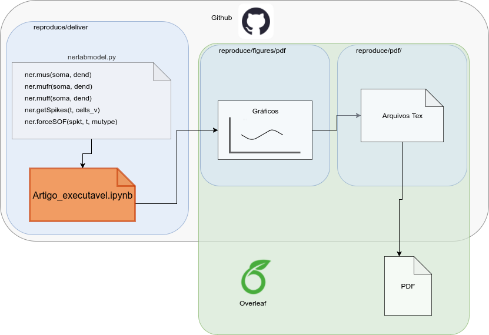

# Model of the neuromuscular system

This repository contains a simplified model of the neuromuscular system. It was implemented using the NEURON simulator with Python using NetPyNE.

## Environment

These are the dependencies to run the model:
1. Python 2.7 (https://www.python.org/)
2. NEURON 7.4 (https://neuron.yale.edu)
3. NetPyNE 0.7.0 (https://netpyne.org)
4. The files in this repository.

You can run the model using a **dock container**, further described, or manually install the dependencies .

## Using the docker container

First, install Docker following the instructions on https://docs.docker.com/install/, according to your operational system.

You will use an docker image called [heitorsf/nerlab:reproduce](https://hub.docker.com/r/heitorsf/nerlab) to create a *container* (the link is just an reference to Docker Hub). You can name this container and start it again later. For that, use the following command in a console or terminal:

```
docker run -it -p 8888:8888 --name my_container heitorsf/nerlab:reproduce
```

*In Lunix there may be permission problemas, in this case, use `sudo docker (...)`.*

An URL will appear on your screen, copy and paste it in a web browser to access the jupyter notebook.

Once inside the jupyter notebook, go to the directory `reproducible/deliver` and open the file: `Artigo_Executavel.ipnb`.

To close the container, press Ctrl+c in the terminal or console from which you run the container.

If you want to start the same container again, use:

```
docker start -i my_container
```

## Workflow

The execution of the notebook is structured in integration between Github and Overleaf. To generate a PDF, just clone this repository and link it to an Overleaf account ([Github + Overleaf](https://www.overleaf.com/learn/how-to/How_do_I_connect_an_Overleaf_project_with_a_repo_on_GitHub,_GitLab_or_BitBucket%3F)).




For support, please contact heitorsf at gmail dot com or h074096 at dac dot unicamp dot br

[](https://mybinder.org/v2/gh/heitorsf/reproducible/master)
